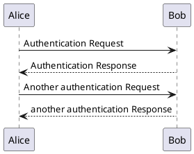

Some examples
==========

## some code highlighting?

```javascript
 Array(16).join( 'hero'-1) + "Batman";
```

## Wanna see some Plantuml?


```plantuml
@startuml
Alice -> Bob: Authentication Request
Bob --> Alice: Authentication Response

Alice -> Bob: Another authentication Request
Alice <-- Bob: another authentication Response
@enduml
```
